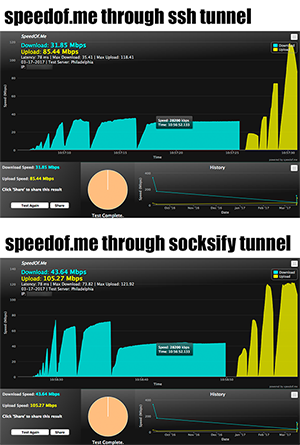

# AlmondRocks

A tunneling tool for connecting out past a NAT device and extending an SSL-encrypted SOCKS proxy inward.

DISCLAIMER: This tool is currently in BETA

## But y tho?
We ran into a couple of cases where we needed a tool like this:

*There are tons of SOCKS proxies out there*

I wasn't able to find an implementation that allows the SOCKS server and exit nodes to
- exist on separate hosts, and
- multiplex all connections through one TCP session.

*Why not just use SSH?*

In order to achieve this same goal with SSH you could create a reverse proxy pointing to localhost SSH and then SSH with dynamic forwarding to the internal host, but that would require logging in to the system, which would create logs that a low user couldn't clean. Assuming SSH is even running on that server in the first place...

*Why Python? This could be way faster in C!*

Portability is a huge reason. And since most of this stuff is backended by socket/select/pthread, it's already optimized in cpython :) Besides, in my testing, this wasn't exactly slow:



## Setup
*AlmondRocks* is written in standard Python (does not require any third-party packages).

If you're using SSL, then on the server create a key and certificate. To create a signed certificate, you should use a service like [Let's Encrypt](https://letsencrypt.org/getting-started/).

However, you can also use self-signed certs:
```
$ openssl req -x509 -newkey rsa:2048 -keyout key.pem -out cert.pem -nodes
```

## Running *AlmondRocks*
You can either run in *server* or *relay* mode. Each has its own options, which you can see by specifying the mode and **-h**.
- Server mode: Run on machine with connectivity to Internet. Listens for relays, and for SOCKS clients.
- Relay mode: Run on host in destination network. Calls out to the AlmondRocks server.

When using default ports on the *server*, the *relay* should connect to public.IP.of.server:4433 and SOCKS clients on the server should connect to 127.0.0.1:1080.

An example proxychains configuration file located on the server would contain:

**/etc/procychains.conf**
```
...
[ProxyList]
socks5 127.0.0.1 1080
...
```

### SSL mode (default)
On the server:
```
$ ./almondrocks.py server --cert cert.pem --key key.pem
```
On the relay:
```
$ ./almondrocks.py relay --connect 1.2.3.4:4433
  -- or --
$ echo relay --connect 1.2.3.4:4433 | ./almondrocks.py
```

### Non-SSL mode (not recommended)
On the server:
```
$ ./almondrocks.py server
```
On the relay:
```
$ ./almondrocks.py relay --connect 1.2.3.4:4433 --no-ssl
  -- or --
$ echo relay --no-ssl --connect 1.2.3.4:4433 | ./almondrocks.py
```

## Other features
### AROX Prompt
You can type CTRL-\ to reach an internal prompt. The following options are supported:
```
AROX> ?

.: AROX Options :.
?...:  Show this menu
s...:  Show Tunnel statistics
k...:  Kill a Channel
V...:  Increase logging verbosity
v...:  Decrease logging verbosity
```

The logging options allow you to increase and decrease verbosity without restarting the tunnel. This is helpful for debugging, or for limiting the amount of output printed to the terminal.
```
AROX> V

[+] Logging verbosity increased to INFO
[2017-04-09 17:33:37]     INFO server: Terminating thread that handled <Channel id=79 bytes_tx=820B bytes_rx=62K> <--> 127.0.0.1:53848
[2017-04-09 17:33:37]     INFO server: Terminating thread that handled <Channel id=80 bytes_tx=719B bytes_rx=102K> <--> 127.0.0.1:53850
[2017-04-09 17:33:39]     INFO server: Accepted SOCKS client connection from 127.0.0.1:53858
```

The statistics view shows statistics for the tunnel and each active channel; each channel represents a connection made by a SOCKS client. The kill option allows you to close individual channels.
```
AROX> s

################################# Stats For Nerds #################################
<Tunnel OpenChannels=2 ClosedChannels=96 BytesTX=1M BytesRX=33M>
`-> <Channel id=76 bytes_tx=2K bytes_rx=2K>
`-> <Channel id=82 bytes_tx=1K bytes_rx=2K>
###################################################################################

AROX> k

ChannelID? 82
[2017-04-09 17:40:31]     INFO server: Terminating thread that handled <Channel id=82 bytes_tx=1K bytes_rx=2K> <--> 127.0.0.1:53854
```
