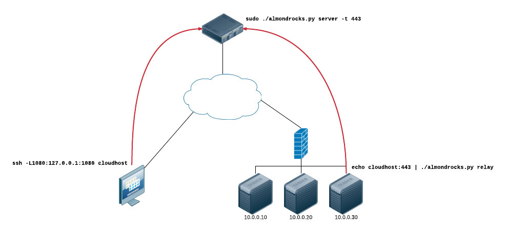

# AlmondRocks

A tunneling tool for connecting out past a NAT device and extending an SSL-encrypted SOCKS proxy inward.

In the following example, the workstation on the left is able to proxy traffic using the SOCKSv5 proxy 127.0.0.1:1080 into the firewalled network on the right:



## But y tho?
We ran into a couple of cases where we needed a tool like this:

*There are tons of SOCKS proxies out there*

I wasn't able to find an implementation that allows the SOCKS server and exit nodes to
- exist on separate hosts, and
- multiplex all connections through one TCP session.

*Why not just use SSH?*

In order to achieve this same goal with SSH you could create a reverse proxy pointing to localhost SSH and then SSH with dynamic forwarding to the internal host, but that would require logging in to the system, which would create logs that a low user couldn't clean. Assuming SSH is even running on that server in the first place...

*Why Python? This could be way faster in C!*

Portability is a huge reason. And since most of this stuff is backended by socket/select/pthread, it's already optimized in cpython :) Besides, in my testing, this wasn't exactly slow:


## Setup
*AlmondRocks* is written in standard Python (does not require any third-party packages).

If you're using SSL, then on the server create a key and certificate. To create a signed certificate, you should use a service like [Let's Encrypt](https://letsencrypt.org/getting-started/).

However, you can also use self-signed certs:
```
$ openssl req -x509 -newkey rsa:2048 -keyout key.pem -out cert.pem -nodes
```

## Running *AlmondRocks*
You can either run in *server* or *relay* mode. Each has its own options, which you can see by specifying the mode and **-h**.

### SSL mode (default)
On the server:
```
$ ./almondrocks.py server --cert cert.pem --key key.pem
```
On the relay:
```
$ ./almondrocks.py relay --connect 1.2.3.4:4433
  -- or --
$ echo 1.2.3.4:4433 | ./almondrocks.py relay
```

### Non-SSL mode (not recommended)
On the server:
```
$ ./almondrocks.py server
```
On the relay:
```
$ ./almondrocks.py relay --connect 1.2.3.4:4433 --no-ssl
  -- or --
$ echo 1.2.3.4:4433 | ./almondrocks.py relay --no-ssl
```

## Architecture
### Tunnel
The tunnel is the primary transport that multiplexes channels and provides network connectivity.

### Channels
Channels are client software's interface to the **Tunnel**. To send data across a tunnel, instantiate a channel associated with your tunnel (with `Tunnel.open_channel`) and use it as you would a socket.

Under the hood, a channel is a glorified TCP socket pair; the tunnel uses one end, and you use the other.

### Messages
Messages are the **Tunnel**'s mechanism for encapsulating channel data and tunnel control primitives. Everything sent across the tunnel is sent as a message.

### Server
A server accepts a tunnel connection from a **Relay**. Once the relay connects, the server starts accepting connections from SOCKSv5 clients.

When a SOCKS client connects, the Server creates a new channel and proxies data between the SOCKS client and the channel.

### Relay
A relay connects a tunnel back to a **Server**. When the server opens a new channel, the relay receives data for that channel, and connects to a remote endpoint if a valid SOCKSv5 CONNECT message is received.

Once connected, the relay proxies data between the channel and remote endpoint for the life of the channel.
